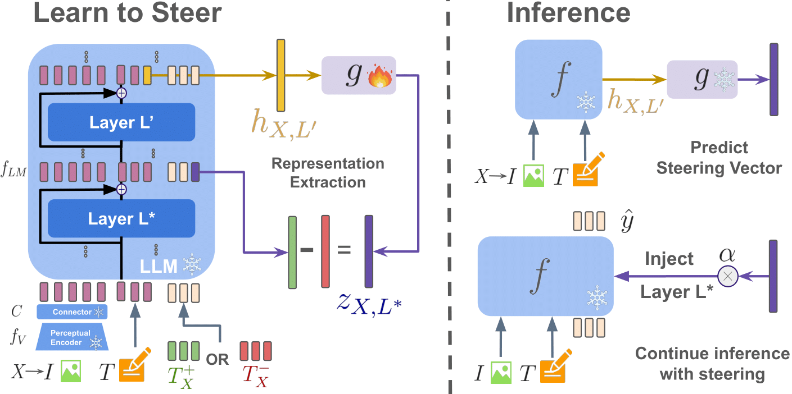

# Learning to Steer: Input-dependent Steering for Multimodal LLMs

<div align="left">
<h3>
Advances in Neural Information Processing Systems (NeurIPS) 2025
</h3>

<a href="https://jayneelparekh.github.io/learn-to-steer/">  </a> [](https://arxiv.org/abs/2508.12815)

## Abstract/Overview
Steering has emerged as a practical approach to enable post-hoc guidance of LLMs towards enforcing a specific behavior. However, it remains largely underexplored for multimodal LLMs (MLLMs); furthermore, existing steering techniques, such as mean steering, rely on a single steering vector, applied independently of the input query. This paradigm faces limitations when the desired behavior is dependent on the example at hand. For example, a safe answer may consist in abstaining from answering when asked for an illegal activity, or may point to external resources or consultation with an expert when asked about medical advice. In this paper, we investigate a fine-grained steering that uses an input-specific linear shift. This shift is computed using contrastive input-specific prompting. However, the input-specific prompts required for this approach are not known at test time. Therefore, we propose to train a small auxiliary module to predict the input-specific steering vector. Our approach, dubbed as L2S (Learn-to-Steer), demonstrates that it reduces hallucinations and enforces safety in MLLMs, outperforming other static baselines.
<br> <br>
<p align="center">
  
</p>

## Installation

This repository is built on top of our parent [XL-VLMs](https://github.com/mshukor/xl-vlms) repository which contains code for our previous works on explainability and steering of multimodal LLMs. Feel free to refer/explore it if these works are also relevant for you.

### Environment 

Please refer to [docs/installation.md](docs/installation.md) for environment installation instructions (based on the parent repo)

### Datasets

* The MMSafetyBench dataset can be downloaded at [this link](https://github.com/isXinLiu/MM-SafetyBench)
* The POPE dataset can be downloaded at [this link](https://github.com/RUCAIBox/POPE)

We encourage checking out [src/datasets/image_text_dataset.py](src/datasets/image_text_dataset.py) for details about the dataset classes. The prompt completions depending upon the input are also defined there.

### Models

Our experiments in the paper are on the following models:
* **LLaVA-v1.5-7b**
* **Qwen2-VL-7B-Instruct**

In general, owing to the parent [XL-VLMs](https://github.com/mshukor/xl-vlms) repo we support models from the `transformers` library.

## Main Experiments

### Feature Extraction

The extraction of features from the two prompt completions and context vectors can all be performed by running the bash scripts
* For safety experiments: 
```
cd learn-to-steer
bash src/examples/learned_steering/L2S/safety/0_extract_representations.sh
```

* For hallucination experiments: 

The bash scripts also contain details (through comments or otherwise) about arguments used for both models

### Training L2S

Based on the extracted features, a L2S model can be trained by running the following bash scripts
* For safety experiments: 
```
bash src/examples/learned_steering/L2S/safety/1_train_l2s.sh
```
* For hallucination experiments:

Our pretrained L2S auxiliary networks for each base model are available in [src/assets/L2S](src/assets/L2S). <br>
L2S network architecture and their training strategy is given in [src/analysis/learnable_model_steering.py](src/analysis/learnable_model_steering.py)

### Inference 

Given a pretrained L2S model, inference can be performed with the following bash scripts
```
bash src/examples/learned_steering/L2S/safety/2_inference_with_l2s.sh
bash src/examples/learned_steering/L2S/hallucination/2_inference_with_l2s.sh
```


### Evaluation

Given a file containing generated responses, use the following bash scripts for evaluation for safety experiments
```
bash src/examples/learned_steering/L2S/safety/3_response_eval.sh
```

## Citations

If you find this repo or our work useful, you can cite the work as follows:

```bibtex
@article{parekh2025learning,
  title={Learning to Steer: Input-dependent Steering for Multimodal LLMs},
  author={Parekh, Jayneel and Khayatan, Pegah and Shukor, Mustafa and Dapogny, Arnaud and Newson, Alasdair and Cord, Matthieu},
  journal={Advances in Neural Information Processing Systems},
  year={2025}
}
```
